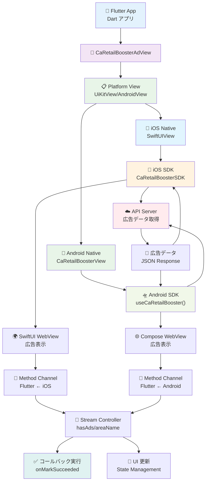

# CLAUDE.md

This file provides guidance to Claude Code (claude.ai/code) when working with code in this repository.

# Flutter SDK

## リポジトリ

[caretailbooster-sdk-flutter](https://github.com/CyberAgentAI/caretailbooster-sdk-flutter)

## 環境構築手順

### 前提条件

- Flutter 3.3.0+
- Dart 2.18.0+
- Android Studio / Xcode
- iOS 13.0+ / Android API 24+ (Android 7.0+)

### セットアップ（サンプルアプリの起動まで）

1. Flutter のインストール

   基本的にどのパッケージマネージャーを使用しても構いません。以下は代表的な例です。

   - **公式インストーラー**: [Flutter 公式サイト](https://flutter.dev/docs/get-started/install)からインストール

   - **Homebrew を使用**:

     ```bash
     # Flutter のインストール
     brew install flutter

     # パスの確認（必要に応じて .zshrc や .bash_profile に追加）
      echo 'export PATH="$PATH:/opt/homebrew/bin/flutter/bin"' >> ~/.zshrc
      source ~/.zshrc
     ```

   - **asdf を使用**:

     ```bash
     # Flutter プラグインを追加
     asdf plugin add flutter

     # 最新版をインストール
     asdf install flutter latest

     # グローバルに設定
     asdf global flutter latest
     ```

   - インストール後の確認:
     ```bash
     flutter doctor
     ```

2. 依存関係のインストール

   ```bash
   # プロジェクトルートで実行
   flutter pub get
   cd example && flutter pub get

   # iOS の場合
   cd example/ios && pod install
   ```

3. サンプルアプリの起動
   ```bash
   cd example
   flutter run
   ```
   - iOS/Android シミュレーターが起動し、広告が表示されれば OK

## アーキテクチャ

### 全体構成

```
caretailbooster-sdk-flutter/
├── lib/
│   ├── caretailbooster_sdk.dart           # SDK エントリーポイント
│   └── src/
│       ├── widgets/                        # Flutter ウィジェット
│       │   ├── caretailbooster_ad_view.dart    # メイン広告ビューウィジェット
│       │   └── caretailbooster_ad_item.dart    # 広告アイテム
│       └── models/                         # データモデル
│           ├── run_mode.dart               # 環境設定（enum）
│           ├── ad_options.dart             # 広告表示オプション
│           └── method_call_type.dart       # Method Channel通信定義
├── android/                                # Android プラットフォーム実装
│   └── src/main/kotlin/
│       └── com/example/caretailbooster_sdk/
│           ├── CaRetailBoosterSdkPlugin.kt     # Android プラグインメイン
│           ├── CaRetailBoosterViewFactory.kt   # Android ビューファクトリ
│           ├── CaRetailBoosterView.kt          # Android ネイティブビュー
│           └── CaRetailBoosterMethodCall.kt    # Android メソッドコール定義
├── ios/                                    # iOS プラットフォーム実装
│   └── Classes/
│       ├── CaRetailBoosterSdkPlugin.swift      # iOS プラグインメイン
│       ├── SwiftUIViewFactory.swift            # iOS ビューファクトリ
│       ├── SwiftUIView.swift                   # iOS SwiftUI ビュー
│       ├── SwiftUIViewNotification.swift       # iOS 通知管理
│       └── CaRetailBoosterMethodCallType.swift # iOS メソッドコール定義
├── example/                                # サンプルアプリケーション
│   ├── lib/
│   │   └── main.dart                       # サンプルアプリのメイン
│   ├── android/                            # Androidプロジェクト設定
│   └── ios/                                # iOSプロジェクト設定
├── test/                                   # ユニットテスト
├── pubspec.yaml                            # Flutter パッケージ設定
└── README.md                               # プロジェクトREADME
```

### 主要コンポーネント

#### **CaRetailBoosterAdView** (`lib/src/widgets/caretailbooster_ad_view.dart`)

- **役割**: SDK のメインエントリーポイント
- **機能**:
  - Platform View (UiKitView/AndroidView) による iOS/Android ネイティブビューの埋め込み
  - Method Channel による Flutter ↔ Native 間通信
  - 広告表示オプションの設定とコールバック処理
  - StreamController でリアクティブな状態管理
- **特徴**:
  - `ca_retail_booster_ad_view_$viewId` パターンでチャンネル作成
  - hasAds、areaName、areaDescription のストリーム提供
  - onMarkSucceeded、onRewardModalClosed のコールバック

#### **RunMode** (`lib/src/models/run_mode.dart`)

- **役割**: SDK 実行環境の定義
- **機能**:
  - 環境切り替え（local、dev、stg、prd、mock）
  - ネイティブ側への環境情報伝達
- **特徴**: enum 型による型安全な環境管理

#### **AdOptions** (`lib/src/models/ad_options.dart`)

- **役割**: 広告表示設定の管理
- **機能**:
  - レイアウト設定（width、height、spacing、margins）
  - UI 要素の制御（hiddenIndicators）
- **特徴**: null 許容型による柔軟な設定

#### **MethodCallType** (`lib/src/models/method_call_type.dart`)

- **役割**: Flutter-Native 間の通信メソッド定義
- **機能**:
  - コールバックイベントの定義（markSucceeded、rewardModalClosed、hasAds 等）
  - メソッド名と Enum の相互変換
  - 通信エラーハンドリング
- **特徴**: 型安全な Method Channel 通信

#### **ネイティブプラットフォーム実装**

- **Android** (`android/src/main/kotlin/`)
  - Kotlin 実装、AndroidView 使用
  - CaRetailBoosterView で Jetpack Compose UI を埋め込み
  - Maven 経由でネイティブ SDK 依存
  - 最小 API 24 以上が必要
- **iOS** (`ios/Classes/`)
  - Swift 実装、UiKitView 使用
  - SwiftUIView で iOS SDK のビューを埋め込み
  - CocoaPods 経由でネイティブ SDK 依存
  - iOS 13.0 以上が必要

### データフロー



### プラットフォーム実装

- **iOS**: SwiftUI + CaRetailBoosterSDK（既存の iOS SDK）
  - ネイティブ SDK 内部で WebView を使用して広告を表示
- **Android**: Kotlin + CaRetailBoosterSDK（既存の Android SDK）
  - ネイティブ SDK 内部で WebView を使用して広告を表示
- **Flutter**: Platform View + Method Channel によるブリッジ
  - Flutter 側は直接 WebView を扱わず、ネイティブ SDK に委譲

### 通信フロー

1. Flutter アプリが `CaRetailBoosterAdView` を初期化
2. Platform View が iOS/Android ネイティブビューを作成
3. ネイティブ SDK が広告データを取得・表示
4. ユーザーのアクション（リワード獲得など）が発生
5. Method Channel 経由で Flutter にコールバック送信

## デバッグ方法

### ログの確認

- **Flutter logs**: `flutter logs` コマンドで実行中のログを確認
- **Android Studio**: Logcat ウィンドウで詳細ログ確認
- **Xcode Console**: iOS 実行時のネイティブログ確認
- **VS Code**: Debug Console パネルでログ確認

### プラットフォーム固有のデバッグ

#### Android

- Android Studio でブレークポイント設定（Kotlin コード）
- `adb logcat` でネイティブログ確認
- **WebView のデバッグ**:
  - Chrome DevTools を使用して WebView をデバッグ
  - Android デバイス/エミュレータで開発者オプションを有効化
  - Chrome で `chrome://inspect` を開く
  - 接続されたデバイスの WebView を選択して inspect

#### iOS

- Xcode でブレークポイント設定（Swift コード）
- **WebView のデバッグ**:
  - シミュレーターでアプリを起動した状態で Safari を開く
  - Safari 上部のメニューから「開発」を選択
  - 確認したい端末にカーソルを合わせ、確認したい WebView の URL を選択
  - 別ウィンドウで選択した WebView 用の Dev tool が起動する

### よくある問題と解決方法

#### iOS ビルドエラー

```bash
# Podfile.lockを削除して再インストール
cd example/ios
rm -rf Podfile.lock
pod install
```

#### Android ビルドエラー

```bash
# gradle キャッシュクリア
cd example/android
./gradlew clean
```

#### Hot Reload が効かない

- プラットフォーム固有のコード変更時は Hot Restart（R）または再ビルドが必要

#### 広告が表示されない

- 初期化パラメータの確認（mediaId、userId、crypto）
- ネットワーク状況の確認
- 実行モードの確認（mock モードでテスト可能）

#### コードの問題はないのにビルドが落ちる

```bash
# 対象ディレクトリで実行（困ったらこれを実行）
flutter clean
flutter pub get
```

## 開発時の注意事項

### コード規約

- Dart: [Effective Dart](https://dart.dev/guides/language/effective-dart)に従う
- `flutter analyze` でリント確認
- `flutter format` でコード整形

### テスト実行

```bash
# テスト実行（基本的なウィジェットテストのみ）
flutter test
```
